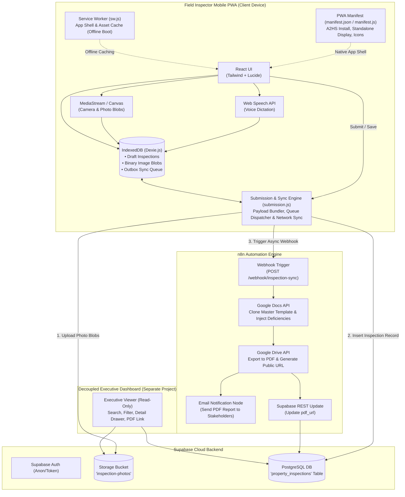

# System Architecture & Technical Flow

## 1. System Architecture Overview

The system is architected as an **offline-first, event-driven pipeline** optimized for field operations with decoupled document generation and decoupled review capabilities.



---

## 2. End-to-End Data Pipeline

### Stage 1: PWA Shell, Client Capture & Offline Persistence
* **Web App Manifest (`manifest.json` / `manifest.js`):** Defines the PWA identity, `display: "standalone"` (removing browser URL/navigation chrome for native app feel), app icons (maskable and standard), theme/background colors, and orientation lock for field usage. Enables seamless home screen installation (A2HS) on iOS/Android.
* **Asset Caching (`sw.js`):** Cache-first strategy for static HTML, CSS, JS, icons, and fonts. Enables the application to boot instantly in 0-bar / Airplane Mode.
* **Punch-List Logging:** Deficiencies are recorded with:
  * Sequence Index (`item_number`: 1, 2, 3...)
  * Location / Room Tag (`area`: e.g. "Kitchen", "Living Room", "Master Bath")
  * Observation Description (`description`: typed or dictated via native Web Speech API)
  * Photo Blob Reference (`photo_id` / raw image Blob)
* **Local Transactional Store (IndexedDB):**
  * All draft inspection fields, items, and image Blobs are written directly to IndexedDB.
  * No memory-only state is relied upon for persistence.

### Stage 2: Submission & Synchronization Engine (`submission.js`)
* **Inspection Packaging:** `submission.js` validates all field inputs, serializes the property metadata and deficiency array, links binary photo blobs, and commits the payload to the IndexedDB `outbox` queue with `status: 'PENDING'`.
* **Online Check & Listeners:**
  * If `navigator.onLine === true`, `submission.js` executes immediately.
  * If offline, `submission.js` registers `window.addEventListener('online', triggerSync)` and waits.
* **Transactional Upload Sequence:**
  1. **Photo Upload:** Iterate over image blobs, uploading each to Supabase Storage bucket `inspection-photos/YYYY-MM/<inspection_id>/<photo_id>.webp`. Collect public/signed URLs.
  2. **Database Insert:** Insert inspection record with resolved `photo_urls` into `property_inspections`.
  3. **Webhook Trigger:** POST JSON payload to the n8n Webhook endpoint.
  4. **Queue Status Update:** Upon successful database insert, update local item to `status: 'SYNCED'`.

### Stage 3: Supabase Cloud Layer
* **PostgreSQL Database:** Hosts the `property_inspections` table.
* **Storage Bucket:** Public or signed `inspection-photos` bucket storing optimized web images.
* **Security & Row Level Security (RLS):** Allows insert and select permissions appropriate for field inspectors and review dashboard readers.

### Stage 4: n8n + Google Docs PDF Pipeline
* **Trigger:** Webhook received from `submission.js` on inspection completion.
* **Template Cloning:** Clones a standardized corporate Google Docs template containing placeholder tags (e.g. `{{ESTATE_NAME}}`, `{{UNIT_NUMBER}}`, `{{INSPECTOR_NAME}}`, `{{DATE}}`).
* **Dynamic Table Injection:** Appends a formatted table mapping all logged deficiencies (`No.`, `Room/Area`, `Description`, `Photos`).
* **PDF Export & Storage:** Converts Google Doc to PDF, stores the PDF in Google Drive / Supabase, and updates `pdf_url` in the Supabase record.
* **Independent Email Delivery:** Dispatches the generated PDF directly to designated stakeholders via email, completely decoupled from the initial mobile submission.

### Stage 5: Decoupled Executive Review Dashboard
* **Independent Read Viewer:** Deployed as an isolated, lightweight web app connecting directly to Supabase.
* **Features:**
  * Searchable table filtering by Estate, Unit, Inspector, and Date.
  * Detail drawer rendering inspection metadata, deficiency table, photo carousel, and direct PDF download links.
  * Complete isolation from the mobile PWA bundle ensures zero bundle penalty for field inspectors.

---

## 3. Offline Resilience & Recovery State Machine

```
[Inspector Action: Submit]
          │
    [Network Active?]
       ├── NO ──► [Save to IDB Outbox: Status = PENDING] ──► [Wait for 'online' event]
       │                                                              │
       └── YES ◄──────────────────────────────────────────────────────┘
          │
    [Process Queue Item]
          ├── Step 1: Upload Photo Blobs to Supabase Storage
          │     └── On Fail: Exponential Backoff & Retry
          ├── Step 2: Write Row to 'property_inspections' Table
          │     └── On Fail: Keep in Outbox, Flag Error
          └── Step 3: Trigger n8n Webhook (Fire-and-Forget)
                └── Step 4: Mark Local Queue Item as SYNCED
```

---

## 4. Performance & Reliability Guarantees
1. **Zero Data Loss:** Image blobs and inspection data persist locally in IndexedDB before any network request is attempted.
2. **Low Payload Overhead:** Photos are compressed and resized on the client before storage to prevent network congestion.
3. **Decoupled PDF Generation:** The mobile app does not wait for Google Docs compilation or PDF rendering; submission confirmation is instant upon Supabase database insertion.
